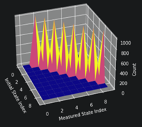
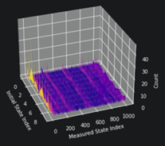
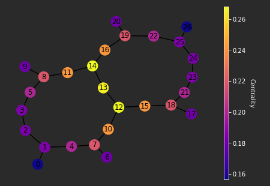

# QML Transpiler

**Quantum Transpilation** is a transformation of given virtual quantum circuit:

* to match the topology of a specific device
* to optimize the circuit for execution

QML Transpiler package provides a family of functions for efficient transpilation of quantum circuits.

## Transpile Functions

`transpile` - custom transpilation with possibility of using:

- pre-defined [transpilation stacks](#transpilation-stacks)
- custom [PassManager](https://docs.quantum.ibm.com/api/qiskit/passmanager)
- dynamical decoupling
- transpiler options

`transpile_chain` - consistently transpile and "stitch" a [chain](#minimal-example) of quantum circuits.

`transpile_right` - transpile additional circuit to the [right part](#shadow-state-tomography) of existing circuit.

`transpile_left` - transpile additional circuit to the [left part](#fourier-adder) of existing circuit.

`transpile_and_compress` - transpile and ["topologically compress"](#topological-compression) a circuit considering a coupling map of selected backend.

## Install

Clone repository:

```bash
git clone https://gitlab.com/haiqu-ai/qml-transpiler.git
```

Go to repository folder and install a local package using pip:

```bash
pip install .
```

## Minimal Example

Transpilation includes placement of *virtual qubits* of a circuit to *physical qubits* of quantum device or simulator.
<br>
    <a>
    
    </a>
<br>
Additionally, SWAP gates can be included to route qubits around backend topology.

`transpile_chain` function transpiles a chain of virtual circuits keeping qubits consistent:

```python
import qiskit

from qiskit.providers.fake_provider import FakeLimaV2

from qml_transpiler import transpile_chain

backend = FakeLimaV2()

circuit = qiskit.QuantumCircuit(3)

circuit.cx(0, 1)
circuit.cx(1, 2)
circuit.cx(0, 2)

circuit.barrier()

circuit.draw()
```

```bash
q_0: ──■─────────■──
     ┌─┴─┐       │
q_1: ┤ X ├──■────┼──
     └───┘┌─┴─┐┌─┴─┐
q_2: ─────┤ X ├┤ X ├
          └───┘└───┘
```

```python
CHAIN = [circuit] * 3

transpiled_circuit = transpile_chain(
    CHAIN,
    backend,
    seed_transpiler=1234
)

transpiled_circuit.draw(fold=-1)
```

```bash
                              ┌───┐           ░ ┌───┐                          ░      ┌───┐          ┌───┐               ┌───┐ ░
      q_1 -> 0 ──■─────────■──┤ X ├──■────────░─┤ X ├─────────────────■────────░───■──┤ X ├──■───────┤ X ├───────────────┤ X ├─░─
               ┌─┴─┐     ┌─┴─┐└─┬─┘┌─┴─┐      ░ └─┬─┘┌───┐     ┌───┐┌─┴─┐┌───┐ ░ ┌─┴─┐└─┬─┘┌─┴─┐┌───┐└─┬─┘┌───┐     ┌───┐└─┬─┘ ░
      q_2 -> 1 ┤ X ├──■──┤ X ├──■──┤ X ├──■───░───■──┤ X ├──■──┤ X ├┤ X ├┤ X ├─░─┤ X ├──■──┤ X ├┤ X ├──■──┤ X ├──■──┤ X ├──■───░─
               └───┘┌─┴─┐└───┘     └───┘┌─┴─┐ ░      └─┬─┘┌─┴─┐└─┬─┘└───┘└─┬─┘ ░ └───┘     └───┘└─┬─┘     └─┬─┘┌─┴─┐└─┬─┘      ░
      q_0 -> 2 ─────┤ X ├───────────────┤ X ├─░────────■──┤ X ├──■─────────■───░──────────────────■─────────■──┤ X ├──■────────░─
                    └───┘               └───┘ ░           └───┘                ░                               └───┘           ░
ancilla_0 -> 3 ────────────────────────────────────────────────────────────────░───────────────────────────────────────────────░─
                                                                               ░                                               ░
ancilla_1 -> 4 ────────────────────────────────────────────────────────────────░───────────────────────────────────────────────░─
                                                                               ░                                               ░
```

## Examples

A folder containing all examples:

[examples/](examples/)

### Basic examples:

[examples.ipynb](examples/examples.ipynb)

    - Transpilation Overview, Stages, Functions
    - Litmus Circuit, Backend
    - Qiskit Transpiler, Pass Manager
    - Circuit Stitching, Full Map
    - Transpile Chain, Right, Left, Compress
    - Transpilation Stacks, QSearch, Synthesis
    - Circuit Hash
    - IBM Cost

### Shadow State Tomography

Efficient Tomography circuits transpilation with `transpile_right` function:

[shadow_state_tomography.ipynb](examples/shadows/shadow_state_tomography.ipynb)

<a>

</a>

### Fourier Adder

Efficient QFT transpilation with `transpile_left` function:

[fourier_adder.ipynb](examples/fourier_adder/fourier_adder.ipynb)

<a>

</a>
<br>
<a>



</a>

### Topological Compression

Select topologically most important qubits of a backend – and then transpiles circuit using limited coupling map – to decrease transpilation and simulation time:

[topological_compression.ipynb](examples/topological_compression/topological_compression.ipynb)

<a>

</a>

### Hashing

[hashing.ipynb](examples/hashing/hashing.ipynb)


## Demonstration

The latest demo:

* [QML Transpiler demonstration - 01 2024](examples/demo_01_2024/transpiler_demo.ipynb)

## Documentation

Detailed description of package structure and functions:

* Deployed to [GitLab Pages](https://mohor.gitlab.io/haiqu/)
* Local [Documents folder](docs/qml_transpiler)

## Transpilation Stacks

Transpilation stacks include below frameworks:

* [Qiskit:](https://github.com/Qiskit/qiskit#readme) Quantum SDK
* [BQSKit:](https://github.com/BQSKit/bqskit#readme) Berkeley Quantum Synthesis Toolkit
* [Pytket:](https://github.com/CQCL/pytket#readme) Python inteface for Quantinuum TKET compiler

Following pre-defined transpilation stacks are available:

```python
"qiskit"
"qiskit_qsearch"
"qiskit_qfactor_qsearch"
"qiskit_pytket"
```

To install pre-defined stacks support:

```bash
pip install .[stacks]
```

To install only BQSKit or only Pytket support:

```bash
pip install .[bqskit]
pip install .[pytket]
```

## Testing

Install [pytest](https://docs.pytest.org/) testing support:

```bash
pip install .[testing]
```

Then run [tests script](tests/run_tests.py):

```bash
python tests/run_tests.py
```
