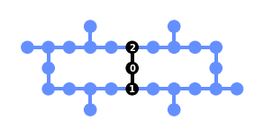

<p align="center">
<picture>
  
</picture>
</p>

# Rivet Transpiler

The package provides a family of functions for efficient transpilation of quantum circuits.

- Function `transpile` - transpilation function featuring:
    - Different transpilation stacks:
        * [Qiskit:](https://github.com/Qiskit/qiskit#readme) Quantum SDK
        * [BQSKit:](https://github.com/BQSKit/bqskit#readme) Berkeley Quantum Synthesis Toolkit
        * [Pytket:](https://github.com/CQCL/pytket#readme) Python interface for Quantinuum TKET compiler
    - Custom PassManager
    - Dynamical decoupling
    - Transpiler options
- Function `transpile_chain` - consistently transpile and "stitch" a chain of quantum circuits
- Function `transpile_right` - transpile an additional circuit to the right part of the existing circuit
- Function `transpile_left` - transpile an additional circuit to the left part of the existing circuit
- Function `transpile_and_compress` - transpile and topologically compress a circuit considering a coupling map of the selected backend

## Installation

To install Rivet Transpiler, please clone the repository:

```bash
git clone https://github.com/haiqu-ai/rivet.git
```

To install the transpiler with all supported stacks:

```bash
pip install .[stacks]
```

To install only BQSKit or only Pytket support:

```bash
pip install .[bqskit]
pip install .[pytket]
```

## Documentation

For more details about the Rivet Transpiler, please check the [reference documentation](https://haiqu-ai.github.io/rivet).


## Tutorials

- [Transpilation Overview, Stages, Functions](examples/examples.ipynb)
- [Shadow State Tomography](examples/shadows/shadow_state_tomography.ipynb)
- [Fourier Adder](examples/fourier_adder/fourier_adder.ipynb)
- [Topological Compression](examples/topological_compression/topological_compression.ipynb)
- [Hashing](examples/hashing/hashing.ipynb)


## Basic Example

<br>
    <a>
    
    </a>
<br>

Transpilation includes placement of *virtual qubits* of a circuit to *physical qubits* of the quantum device or simulator. Additionally, SWAP gates can be included to route qubits around the backend topology.

Here we present a simple quantum circuit with 3 qubits before and after transpilation (using the function `transpile_chain` which transpiles a chain of virtual circuits keeping qubits consistent).

### BEFORE transpilation

```python
import qiskit

from qiskit.providers.fake_provider import FakeLimaV2

from rivet_transpiler import transpile_chain

backend = FakeLimaV2()

circuit = qiskit.QuantumCircuit(3)

circuit.cx(0, 1)
circuit.cx(1, 2)
circuit.cx(0, 2)

circuit.barrier()

circuit.draw()
```

```bash
q_0: ──■─────────■──
     ┌─┴─┐       │
q_1: ┤ X ├──■────┼──
     └───┘┌─┴─┐┌─┴─┐
q_2: ─────┤ X ├┤ X ├
          └───┘└───┘
```

### AFTER transpilation 

```python
CHAIN = [circuit] * 3

transpiled_circuit = transpile_chain(
    CHAIN,
    backend,
    seed_transpiler=1234
)

transpiled_circuit.draw(fold=-1)
```

```bash
                              ┌───┐           ░ ┌───┐                          ░      ┌───┐          ┌───┐               ┌───┐ ░
      q_1 -> 0 ──■─────────■──┤ X ├──■────────░─┤ X ├─────────────────■────────░───■──┤ X ├──■───────┤ X ├───────────────┤ X ├─░─
               ┌─┴─┐     ┌─┴─┐└─┬─┘┌─┴─┐      ░ └─┬─┘┌───┐     ┌───┐┌─┴─┐┌───┐ ░ ┌─┴─┐└─┬─┘┌─┴─┐┌───┐└─┬─┘┌───┐     ┌───┐└─┬─┘ ░
      q_2 -> 1 ┤ X ├──■──┤ X ├──■──┤ X ├──■───░───■──┤ X ├──■──┤ X ├┤ X ├┤ X ├─░─┤ X ├──■──┤ X ├┤ X ├──■──┤ X ├──■──┤ X ├──■───░─
               └───┘┌─┴─┐└───┘     └───┘┌─┴─┐ ░      └─┬─┘┌─┴─┐└─┬─┘└───┘└─┬─┘ ░ └───┘     └───┘└─┬─┘     └─┬─┘┌─┴─┐└─┬─┘      ░
      q_0 -> 2 ─────┤ X ├───────────────┤ X ├─░────────■──┤ X ├──■─────────■───░──────────────────■─────────■──┤ X ├──■────────░─
                    └───┘               └───┘ ░           └───┘                ░                               └───┘           ░
ancilla_0 -> 3 ────────────────────────────────────────────────────────────────░───────────────────────────────────────────────░─
                                                                               ░                                               ░
ancilla_1 -> 4 ────────────────────────────────────────────────────────────────░───────────────────────────────────────────────░─
                                                                               ░                                               ░
```

## References

We would like to thank to:

* [Qiskit](https://github.com/Qiskit/qiskit) Quantum SDK
* [BQSKit](https://github.com/BQSKit/bqskit) Berkeley Quantum Synthesis Toolkit
* [Pytket](https://github.com/CQCL/pytket) Python inteface for Quantinuum TKET compiler

## Contacts

Haiqu Inc. [info@haiqu.ai](mailto:info@haiqu.ai)