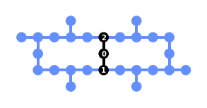

[](https://opensource.org/license/apache-2-0/)
[](https://haiqu-ai.github.io/rivet)

<p align="center">
<picture>
  
</picture>
</p>

# Rivet Transpiler

Quantum Transpilation is the transformation of a given virtual quantum circuit:
- to match the topology of a specific device
- to optimize the circuit for execution

Even at small scales, transpilation becomes a key bottleneck in many complex quantum computing workflows.

## Introduction to Rivet transpiler

Rivet Transpiler allows users to design and implement fast automated modular transpilation routines with the transpilation stack of their choice.

Despite its advanced functionality, Rivet Transpiler is easy to use and includes features such as performance tracking and debugging.

Rivet Transpiler has optimized implementations for Circuit stitching, Topological Compression, Coupling Maps, Hashing, QML, and Shadow State Tomography.


Circuit stitching is a technique used to optimize the routing of quantum circuits on physical quantum hardware. In this process, disconnected qubits, which are not physically adjacent, are brought closer together using SWAP gates.

Topological compression is a tool to help overcome transpilation limitations by taking into account the device’s coupling map. It takes the device's coupling map into account in order to determine the optimal selection of the most important qubits. Before proceeding with computation Rivet Transpiler works hard to achieve the best mapping between the circuit and the device's physical layout in terms of qubit arrangement connectivity.


Users can transpile their entire circuit, or part of a circuit, via the architecture(s) of their preference. Allowing them to transpile optimally for their given use case.

- Qiskit
- BQSKit
- Pytket

## Rivet Transpiler: Transpile Functions

The package provides a family of functions for efficient transpilation of quantum circuits.

- Function `transpile` - transpilation function featuring:
    - Different transpilation stacks:
        * [Qiskit:](https://github.com/Qiskit/qiskit#readme) Quantum SDK
        * [BQSKit:](https://github.com/BQSKit/bqskit#readme) Berkeley Quantum Synthesis Toolkit
        * [Pytket:](https://github.com/CQCL/pytket#readme) Python interface for Quantinuum TKET compiler
    - Custom PassManager
    - Dynamical decoupling
    - Transpiler options
- Function `transpile_chain` - consistently transpile and "stitch" a chain of quantum circuits
- Function `transpile_right` - transpile an additional circuit to the right part of the existing circuit
- Function `transpile_left` - transpile an additional circuit to the left part of the existing circuit
- Function `transpile_and_compress` - transpile and topologically compress a circuit considering a coupling map of the selected backend

## Installation

To install Rivet Transpiler, please clone the repository:

```bash
git clone https://github.com/haiqu-ai/rivet.git
```

To install the transpiler with all supported stacks:

```bash
pip install .[stacks]
```

To install only BQSKit or only Pytket support:

```bash
pip install .[bqskit]
pip install .[pytket]
```

## Documentation

For more details about the Rivet Transpiler, please check the [reference documentation](https://haiqu-ai.github.io/rivet).


## Tutorials

- [Transpilation Overview, Stages, Functions](examples/examples.ipynb)
- [Shadow State Tomography](examples/shadows/shadow_state_tomography.ipynb)
- [Fourier Adder](examples/fourier_adder/fourier_adder.ipynb)
- [Topological Compression](examples/topological_compression/topological_compression.ipynb)
- [Hashing](examples/hashing/hashing.ipynb)


## Basic Example

<br>
    <a>
    
    </a>
<br>

Transpilation includes placement of *virtual qubits* of a circuit to *physical qubits* of the quantum device or simulator. Additionally, SWAP gates can be included to route qubits around the backend topology.

Here we present a simple quantum circuit with 3 qubits before and after transpilation (using the function `transpile_chain` which transpiles a chain of virtual circuits keeping qubits consistent).

### BEFORE transpilation

```python
import qiskit

from qiskit.providers.fake_provider import FakeLimaV2

from rivet_transpiler import transpile_chain

backend = FakeLimaV2()

circuit = qiskit.QuantumCircuit(3)

circuit.cx(0, 1)
circuit.cx(1, 2)
circuit.cx(0, 2)

circuit.barrier()

circuit.draw()
```

```bash
q_0: ──■─────────■──
     ┌─┴─┐       │
q_1: ┤ X ├──■────┼──
     └───┘┌─┴─┐┌─┴─┐
q_2: ─────┤ X ├┤ X ├
          └───┘└───┘
```

### AFTER transpilation 

```python
CHAIN = [circuit] * 3

transpiled_circuit = transpile_chain(
    CHAIN,
    backend,
    seed_transpiler=1234
)

transpiled_circuit.draw(fold=-1)
```

```bash
                              ┌───┐           ░ ┌───┐                          ░      ┌───┐          ┌───┐               ┌───┐ ░
      q_1 -> 0 ──■─────────■──┤ X ├──■────────░─┤ X ├─────────────────■────────░───■──┤ X ├──■───────┤ X ├───────────────┤ X ├─░─
               ┌─┴─┐     ┌─┴─┐└─┬─┘┌─┴─┐      ░ └─┬─┘┌───┐     ┌───┐┌─┴─┐┌───┐ ░ ┌─┴─┐└─┬─┘┌─┴─┐┌───┐└─┬─┘┌───┐     ┌───┐└─┬─┘ ░
      q_2 -> 1 ┤ X ├──■──┤ X ├──■──┤ X ├──■───░───■──┤ X ├──■──┤ X ├┤ X ├┤ X ├─░─┤ X ├──■──┤ X ├┤ X ├──■──┤ X ├──■──┤ X ├──■───░─
               └───┘┌─┴─┐└───┘     └───┘┌─┴─┐ ░      └─┬─┘┌─┴─┐└─┬─┘└───┘└─┬─┘ ░ └───┘     └───┘└─┬─┘     └─┬─┘┌─┴─┐└─┬─┘      ░
      q_0 -> 2 ─────┤ X ├───────────────┤ X ├─░────────■──┤ X ├──■─────────■───░──────────────────■─────────■──┤ X ├──■────────░─
                    └───┘               └───┘ ░           └───┘                ░                               └───┘           ░
ancilla_0 -> 3 ────────────────────────────────────────────────────────────────░───────────────────────────────────────────────░─
                                                                               ░                                               ░
ancilla_1 -> 4 ────────────────────────────────────────────────────────────────░───────────────────────────────────────────────░─
                                                                               ░                                               ░
```

## References

We would like to thank to:

* [Qiskit](https://github.com/Qiskit/qiskit) Quantum SDK
* [BQSKit](https://github.com/BQSKit/bqskit) Berkeley Quantum Synthesis Toolkit
* [Pytket](https://github.com/CQCL/pytket) Python inteface for Quantinuum TKET compiler

## Contacts

Haiqu Inc. [info@haiqu.ai](mailto:info@haiqu.ai)
