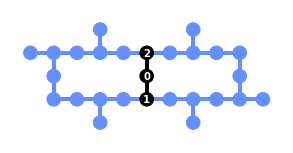

QML Compiler Documentation
=============================

Welcome to Haiqu documentation!

This is the right place where you can find more about Haiqu's state-of-the-art
quantum software platform.

QML Transpiler package provides a family of functions for efficient transpilation
of quantum circuits.

Installation
------------

.. code-block:: bash

   pip install qml_transpiler

Minimal example
-------------------

Transpilation includes placement of *virtual qubits* of a circuit to *physical qubits*
of quantum device or simulator.

Additionally, SWAP gates can be included to route qubits around backend topology.

Function `transpile_chain` transpiles a chain of virtual circuits keeping qubits consistent:

.. code-block:: python

   import qiskit
   from qiskit.providers.fake_provider import FakeLimaV2
   from qml_transpiler import transpile_chain

   backend = FakeLimaV2()

   circuit = qiskit.QuantumCircuit(3)

   circuit.cx(0, 1)
   circuit.cx(1, 2)
   circuit.cx(0, 2)

   circuit.barrier()

   circuit.draw()

.. code-block:: bash

   q_0: ──■─────────■──
        ┌─┴─┐       │
   q_1: ┤ X ├──■────┼──
        └───┘┌─┴─┐┌─┴─┐
   q_2: ─────┤ X ├┤ X ├
             └───┘└───┘

.. code-block:: python

   CHAIN = [circuit] * 3

   transpiled_circuit = transpile_chain(
      CHAIN,
      backend,
      seed_transpiler=1234
   )
   transpiled_circuit.draw(fold=-1)

.. code-block:: bash

                                 ┌───┐           ░ ┌───┐                          ░      ┌───┐          ┌───┐               ┌───┐ ░
         q_1 -> 0 ──■─────────■──┤ X ├──■────────░─┤ X ├─────────────────■────────░───■──┤ X ├──■───────┤ X ├───────────────┤ X ├─░─
                  ┌─┴─┐     ┌─┴─┐└─┬─┘┌─┴─┐      ░ └─┬─┘┌───┐     ┌───┐┌─┴─┐┌───┐ ░ ┌─┴─┐└─┬─┘┌─┴─┐┌───┐└─┬─┘┌───┐     ┌───┐└─┬─┘ ░
         q_2 -> 1 ┤ X ├──■──┤ X ├──■──┤ X ├──■───░───■──┤ X ├──■──┤ X ├┤ X ├┤ X ├─░─┤ X ├──■──┤ X ├┤ X ├──■──┤ X ├──■──┤ X ├──■───░─
                  └───┘┌─┴─┐└───┘     └───┘┌─┴─┐ ░      └─┬─┘┌─┴─┐└─┬─┘└───┘└─┬─┘ ░ └───┘     └───┘└─┬─┘     └─┬─┘┌─┴─┐└─┬─┘      ░
         q_0 -> 2 ─────┤ X ├───────────────┤ X ├─░────────■──┤ X ├──■─────────■───░──────────────────■─────────■──┤ X ├──■────────░─
                       └───┘               └───┘ ░           └───┘                ░                               └───┘           ░
   ancilla_0 -> 3 ────────────────────────────────────────────────────────────────░───────────────────────────────────────────────░─
                                                                                  ░                                               ░
   ancilla_1 -> 4 ────────────────────────────────────────────────────────────────░───────────────────────────────────────────────░─
                                                                                  ░                                               ░

More examples
-------------------

In the repository you could find more complex examples:

* Shadow State Tomography
* Fourier Adder
* Topological Compression
* Hashing

Please visit: https://gitlab.com/haiqu-ai/qml-transpiler

.. toctree::
   :maxdepth: 1
   :hidden:
   :caption: Get Started

   examples_overview.ipynb
   examples_examples.ipynb

.. toctree::
   :maxdepth: 1
   :hidden:
   :caption: API Reference

   api
